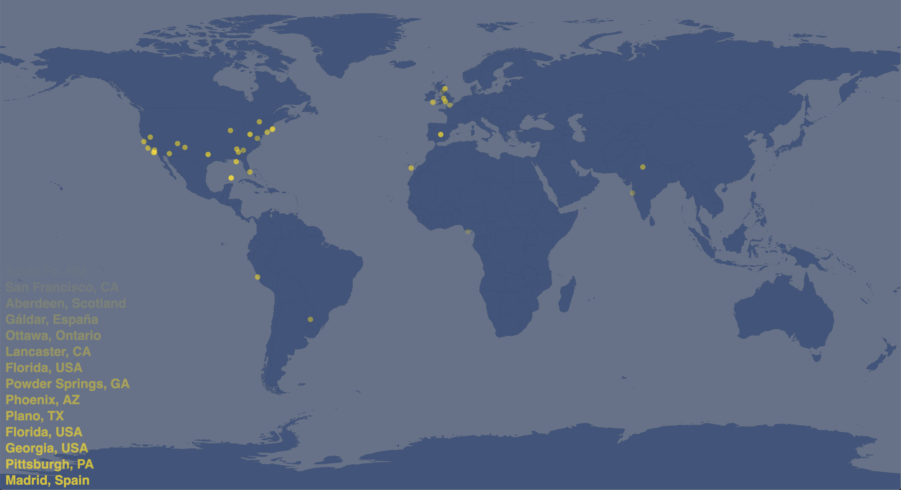
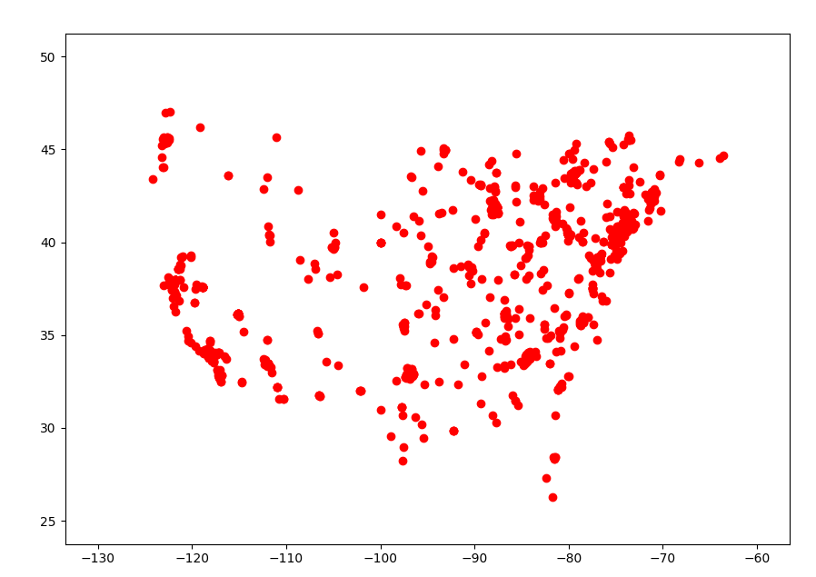

# Twitter Heat Map

The main idea behind this project was to create a visualization of live Twitter
activity. The heat map shows all live tweets that have a geo-tagged location.

[Check Out the Heat Map](https://twitterheatmap.now.sh)

## Proof of Concept

I started this project by creating a proof of concept in python. It used the tweepy
library to access Twitter API and matplotlib to plot the coordinates of the tweets.
This picture is the result of the proof of concept running for around an hour.  

## Migration to JavaScript

At first I thought it would be easiest to make a flask server to run my original
python streaming script and connect it to a JavaScript front end. After a short time
I realized that this would have too many moving parts to keep track of. Instead I decided
to start from scratch and learn how to access Twitter API in JavaScript.

## Accessing Twitter API

The task of authenticating and accessing Twitter API was not as easy as I wanted
it to be. I found the Twitter API docs to be unorganized and hard to read. Eventually
I did figure out how to do it but it took me much longer than expected.  

To access Twitter API I generate a bearer token using my API keys and then build a
`config` object that holds my desired endpoint and authentication token. I then use
`request.get(cofig)` to send my request to Twitter API. Because the endpoint that I am
accessing is a stream, the request I send does not send a packet of data but opens
up a long term connection. I can then listen to this connection using the `on()` callback.  

The stream runs on an AWS EC2 Ubuntu instance. Because I do not want the stream to be
running all the time and use up my various limits, I made it so that the stream only
starts when the webpage is loaded and is closed when the webpage is closed.

## Processing Data

Within the query I make to Twitter API is the `expansions=geo.place_id` tag.
This is because the default response does not contain location data to the specificity level
that I need. What this query does is give me another root level complementary object, `expansions`,
that contains the geo information of the tweet (if it exists). From there I can easily
pull out the longitude, latitude, and place name fields which I then put into a list
and send to the front end using Pusher.

## p5js Front End

The front end of the heat map is written in JavaScript using the p5js library and is hosted on vercel.
In the `setup()` function I subscribe to the `heat-map` channel with Pusher which listens for `tweet` events.
When a `tweet` event occurs, I create a new `tweet` object that contains its coordinates, the time
it was created, and its initial size. I then add the tweet to the beginning of `tweets[]`.
In the `draw()` function I draw a dot on the map for every tweet in `tweets[]`. While
iterating through `tweets[]` I also reduce the transparency value of the dot by one step.
This eventually leads to the dot being completely transparent which is when the tweet gets
deleted from the array.

[See the Heat Map on Github](https://github.com/ebweinberger/heatMap)
