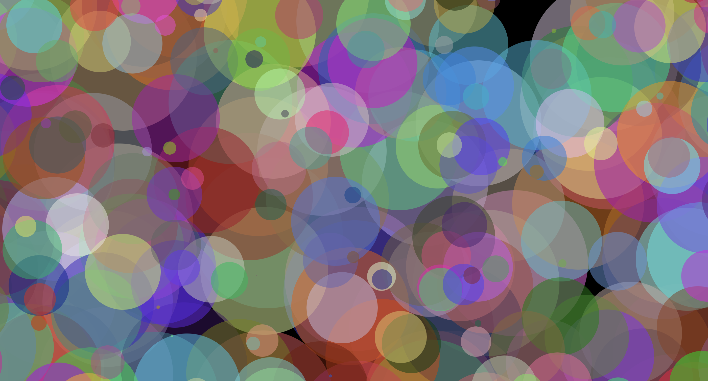

# Speckles

Speckles is a small artisitc project that I made to help me learn p5js and Vercel.  

[Visit speckles.now.sh](https://speckles.now.sh)

## Basic concept

Each circle is a `dot` object that stores its own location, color, size, and age. The animation runs at 30 frames per second. There are a few things that happen in each frame:
* A new circle is born with a random color and location
* Each circle increases its radius by `GROWTH_RATE`
* Each circle checks it's age and when it become older than `DEATH_TIME`, it "pops"

There is also a fullscreen button in the top left corner because I wanted to see how it works in p5js.
This can all be found in `sketch.js`. All the other files are supporting files.  

[See Speckles on Github](https://github.com/ebweinberger/speckles)

## Technologies

p5js is a JavaScript library with a focus on creative use. I plan to use this libary to make an attractive frontend for the social media heat map that I am making.  

[Visit p5js' website](https://p5js.org)

Vercel is a platform that let me host the static webpage easily. I plan to use it for future projects so this was a good introduction to it.  

[Visit Vercel's Website](https://vercel.com)
